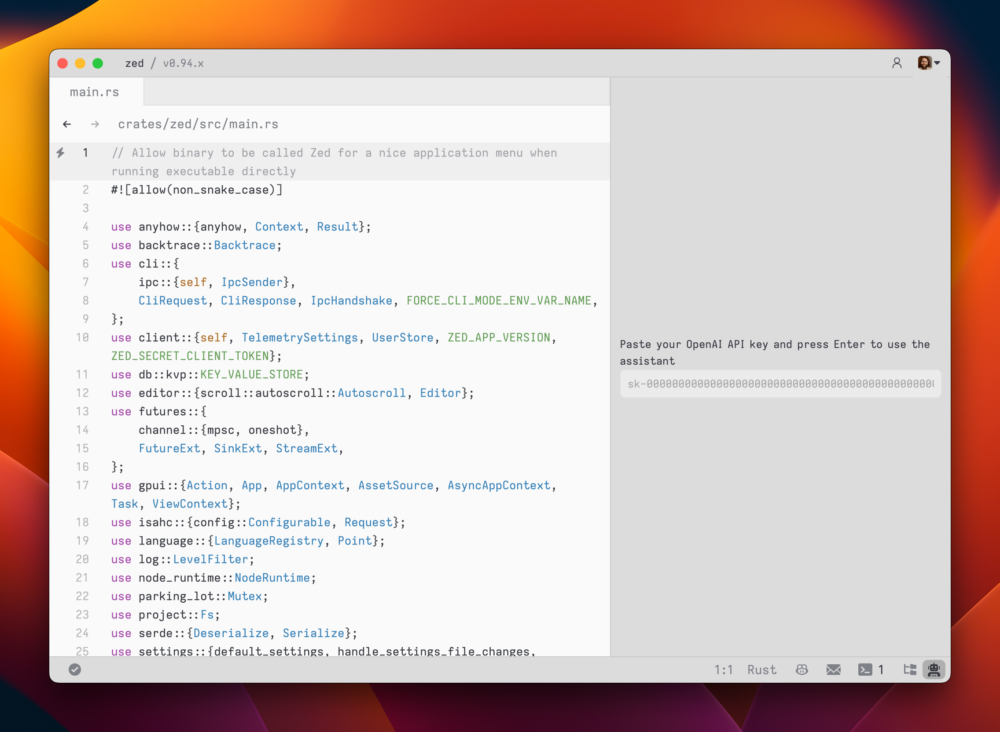
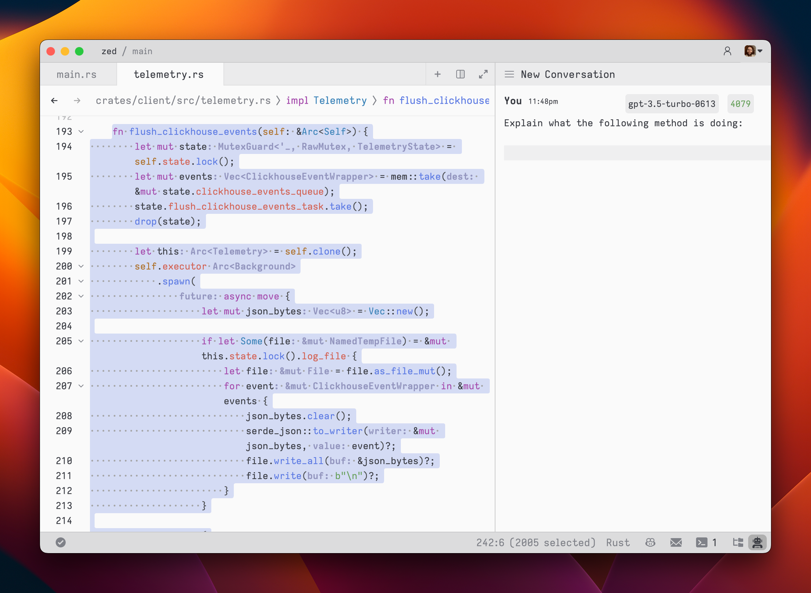
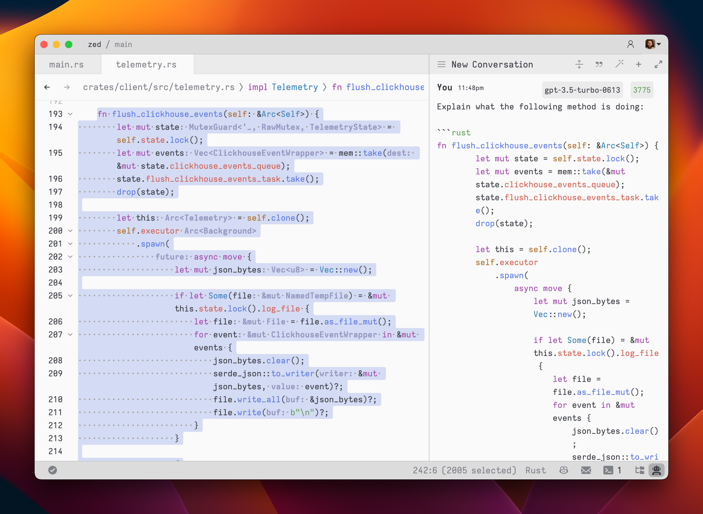
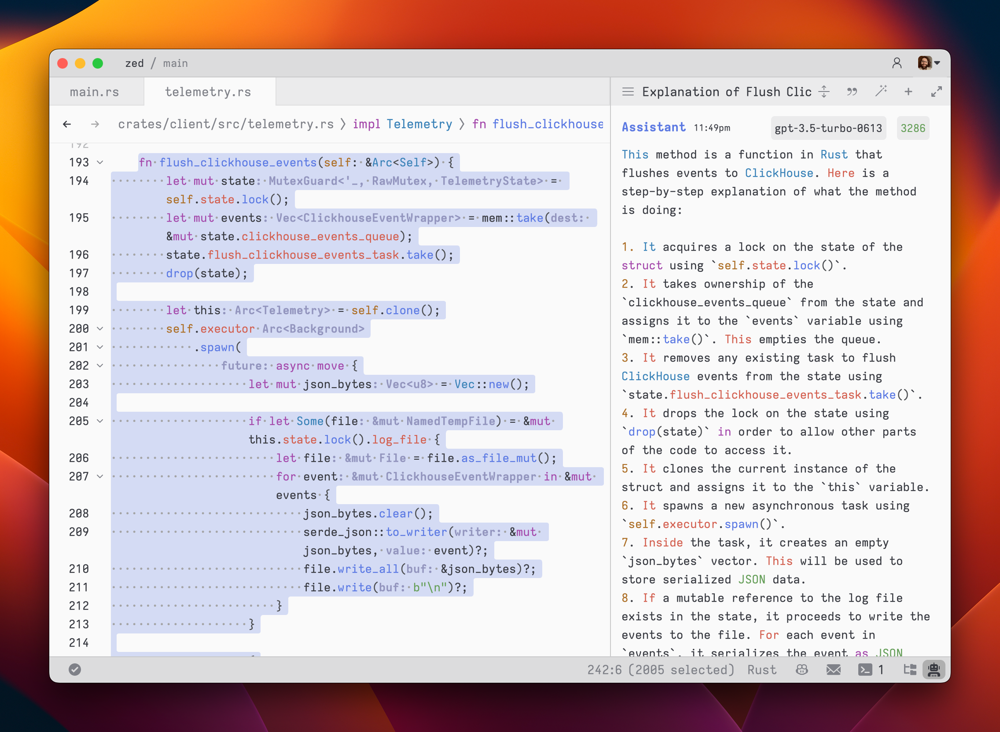
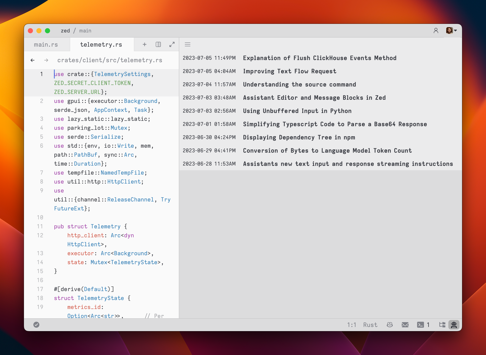

# Assistant Panel

The assistant panel provides you with a way of interacting with OpenAI's large language models. The assistant is good for all sorts of tasks, such as generating code, asking questions about existing code, and even writing plaintext, such as for emails, documentation. Open the assistant panel by toggling the right dock via the `workspace: toggle right toggle` action in the command palette (`cmd-shift-p`).

*Note: A default binding can be set to toggle the right dock via the settings.*

## Setup

When you first open the panel, Zed will ask you for an [OpenAI API key](https://platform.openai.com/account/api-keys), which is saved to your keychain.

Zed will also use the `OPENAI_API_KEY` environment variable if it's defined. If you need to reset your OpenAI API key, focus on the assistant panel and run the command palette action `assistant: reset key`.

## Having a conversation

The assistant editor functions similarly to any other editor in Zed. You can utilize your preferred custom key bindings and work with multiple cursors, enabling seamless transitions between coding and engaging in discussions with LLMs. However, the assistant editor differs with the inclusion of message blocks. Message blocks serve as containers for text that ' to the various roles within the conversation. These roles include:

- `You`
- `Assistant`
- `System`

Begin by selecting a model and typing a message in a `You` block.

As you type, the remaining tokens count for a given model is updated.

Inserting text from an editor is as simple as hightlighting the text and running `cmd->` (`assistant: quote selection`); Zed will wrap it in a fenced code block if it is code.

To submit a message, use `cmd-enter` (`assistant: assist`). This may feel different when compared to typical chat applications, where `enter` submits the message, but our goal when designing the assistant was to make it feel as close to a normal editor as possible, so `enter` simply inserts a newline.

After submitting a message, the assistant's response will be streamed below, in an `Assistant` message block.

The stream can be cancelled at any point with `escape`. This is useful when you notice early on that the response is not what you were looking for.

If at any point in time, you want to start a new conversation, the `New Conversation` button at the top-right corner of the assistant panel can be used.

Simple back-and-forth conversations work pretty well with the assistant, but there will likely come a time when you find yourself wanting to change some previous text in the conversation and steer it a different direction.

## Editing a conversation

The assistant was designed to be as flexible as possible, to put control of the conversation into the user's hands. You can freely edit *any* previous text in the conversation, including responses from the assistant. You can also remove message blocks entirely, by putting your cursor at the beginning of a message block and using `delete`. A typical workflow might look like this:

1. Write some text in a `You` block
2. Submit the message with `cmd-enter`
3. Receive an `Assistant` response that is not quite what you were looking for
4. Cancel the response with `escape`
5. Erase all the content of the `Assistant` message block and remove the block entirely
6. Add additional context to your original message
7. Submit the message with `cmd-enter`

Being able to edit previous messages puts control over how tokens are consumed in your hands. You don't need to start up a new conversation to correct a mistake or add additional context and you don't have to waste tokens by submitting follow-up corrections.

- You are free to change the model type at any point in the conversation.
- You can cycle the role of a message block, by clicking on the role, which is useful when you receive a response in an `Assistant` block that you want to edit and send back up as a `You` block.

## Saving a converation

After you submit your first message, a name for your conversation is generated by the LLM and the conversation is automatically saved to your file system in `~/.config/zed/conversations`. You can access and load previous messages via the hamburger button in the top-left corner of the assistant panel.

Most of the aforementioned actions have toolbar-button equivalents that you can use if you're more GUI driven.

---

## Tricks and tips

Split message
Multicursor
