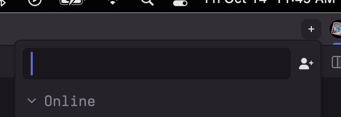
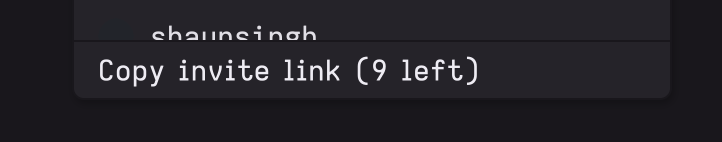
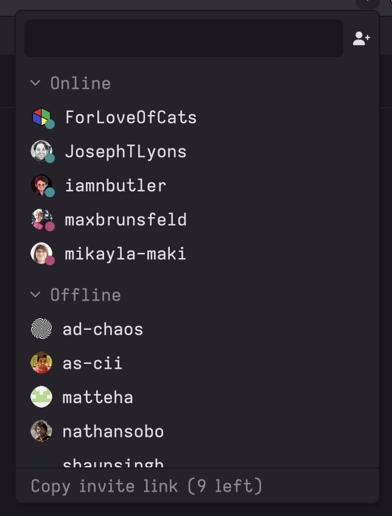
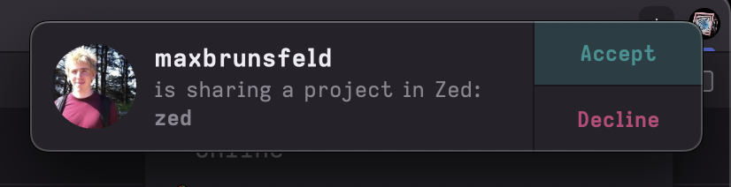
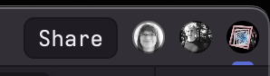
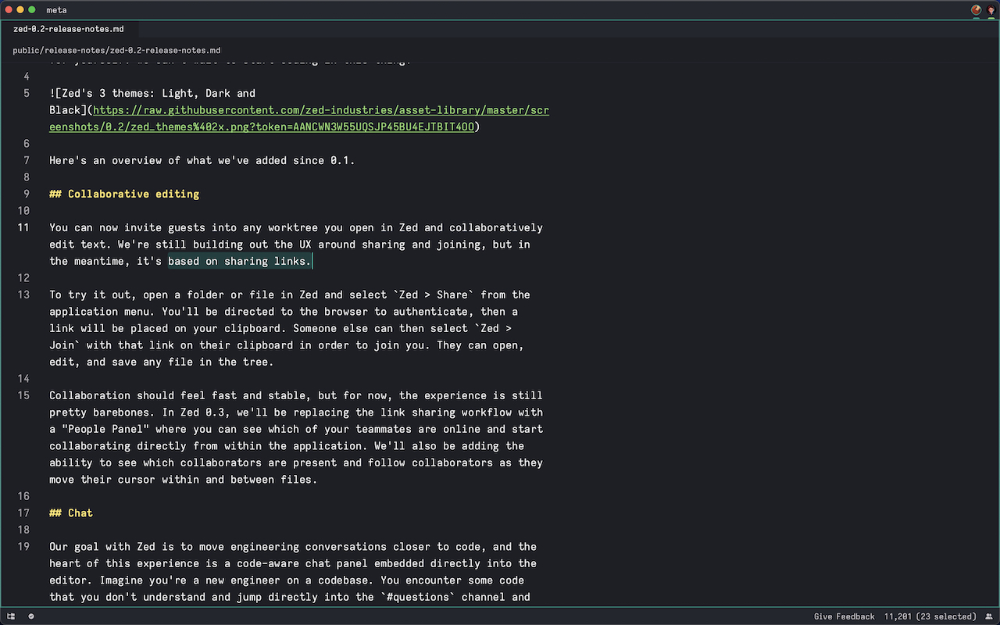
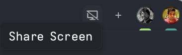
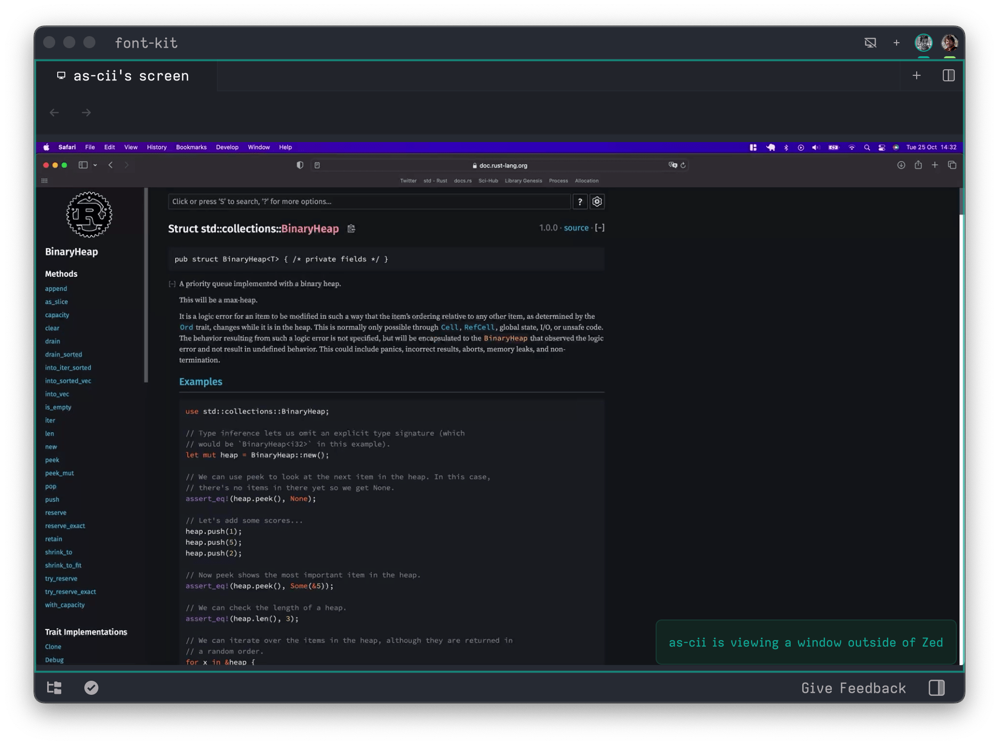
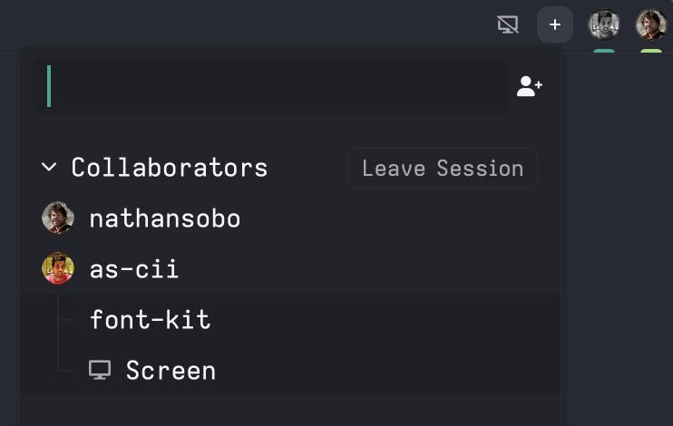

# How to collaborate

#### Adding contacts

You can add an existing Zed user as a contact from the collaboration menu, deployed from the plus icon in the upper right corner of the window or by pressing `cmd-shift-c` and then clicking the add icon button to the right of the search box.

#### Adding a contact

<figure><figcaption>
Adding a contact
</figcaption></figure>

You can invite new Zed users if you have invites by copying an invite link at the bottom of the menu.

<figure><figcaption>
Copy an invite link to share the joy with your friends
</figcaption></figure>

We're limiting invites in order to grow our userbase at a sustainable pace, but contact us at `hi@zed.dev` with your GitHub login if you're an existing user and need invites. When someone joins via your invite link, they're automatically added as a contact.

### Sharing a project

<figure><figcaption>
Contacts list
</figcaption></figure>

You'll see all your online contacts in the collaboration menu. Searching or clicking on them will send a request to start a call and share your current project with them. They will receive a notification to join your call.

<figure><figcaption>
Join a call
</figcaption></figure>

This will open a new window containing their project. Once you have joined the call, your zed windows will show the participants of the call next to your icon in the top right. Grayscale participants are in the call but currently viewing a different project. Non-grayscale participants are in the same project as you.

Projects not yet shared with the call will have a share button in which will enable others to join your project.

<figure><figcaption>
Share a project
</figcaption></figure>

Our goal is to eliminate the distinction between local and remote projects as much as possible. Guests can open, edit, and save files, perform searches, interact with the language server, etc.

### Following a collaborator

When you join a project, you'll immediately start following the host as they move within and between files.

<figure><figcaption>
Follow a collaborator
</figcaption></figure>

You automatically stop following whenever you move the cursor or edit. To start following again, you can click on a collaborator's avatar or cycle through following different participants by pressing `ctrl-alt-cmd-f`.

Following is confined to a particular pane. When a pane is following a collaborator, it is outlined in their cursor color. This pane-specific behavior allows you to follow someone in one pane while navigating independently in another, and can be an effective layout for some styles of collaboration.

### Sharing your screen

Sometimes it's important to share your screen with other call participants, for example to read documentation together or showcase something outside of Zed. You can toggle screen-sharing by clicking on the screen icon next to the plus button.

<figure><figcaption>
Share your screen
</figcaption></figure>

If someone is following you, a new tab will automatically be activated whenever you are viewing an external window.

<figure><figcaption>
People that follow you can look at what you are sharing outside of the editor
</figcaption></figure>

Call participants can always view the shared screen by hitting the plus icon and clicking on the `Screen` entry.

<figure><figcaption>
Viewing the shared screen
</figcaption></figure>
